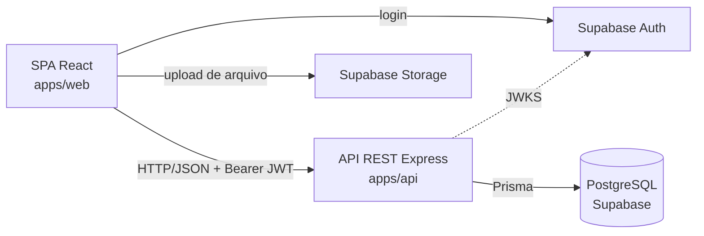

<div align="center">

# Fleet Manager

**Sistema de Gestão Inteligente de Frotas**

Projeto Final Integrador I (PFI I) · Universidade de Fortaleza — UNIFOR
Centro de Ciências Tecnológicas · Curso de Ciência da Computação · 2026

`FM-PFI-2026`

</div>

---

## Sobre o projeto

O Fleet Manager é uma aplicação web que centraliza o controle **operacional, financeiro e documental** de frotas de veículos. O sistema reúne, em uma base de dados única, informações que normalmente ficam dispersas entre planilhas e registros paralelos, organizando-as em torno da entidade que efetivamente as conecta: o veículo.

📄 **Documento principal da entrega:** [`docs/01-descricao-do-problema-e-escopo.md`](docs/01-descricao-do-problema-e-escopo.md)

---

## Problema

Organizações que operam frotas de pequeno e médio porte — tipicamente de 5 a 50 veículos — administram o controle de custos, manutenções e documentação de forma descentralizada, distribuída entre planilhas isoladas e controles manuais.

Como consequência, a organização não dispõe de uma visão consolidada do custo, da condição operacional e da regularidade documental de cada veículo, e passa a agir de forma reativa diante de eventos previsíveis: multas por documentação vencida, manutenções preventivas esquecidas e custo operacional que nunca é apurado por veículo.

O problema não está na ausência de informação, mas na sua **fragmentação** e na **ausência de acompanhamento ativo de prazos**.

---

## Solução proposta

O Fleet Manager ataca o problema por quatro mecanismos:

1. **Centralização em torno do veículo** — toda despesa, manutenção e documento é obrigatoriamente vinculado a um veículo, garantido por integridade referencial no banco.
2. **Acompanhamento ativo de prazos** — o sistema classifica automaticamente a situação de vencimento de documentos e manutenções e os consolida em uma central de alertas.
3. **Consolidação analítica** — um painel apura custo total, custo médio, custo por veículo, evolução mensal e distribuição por categoria, com filtros.
4. **Controle de acesso por perfil** — três perfis distintos separam o registro operacional da decisão gerencial.

---

## Funcionalidades

| Módulo | Situação |
|---|---|
| Autenticação por e-mail e senha (Supabase Auth) | ✅ Implementado |
| Controle de acesso por perfil (ADMIN, MANAGER, OPERATOR) | ✅ Implementado |
| Aprovação e bloqueio de contas de usuário | ✅ Implementado |
| Cadastro de veículos, com desativação e exclusão permanente | ✅ Implementado |
| Cadastro de motoristas e vínculo com veículos | ✅ Implementado |
| Registro de despesas em 6 categorias, com filtros | ✅ Implementado |
| Manutenções preventivas e corretivas | ✅ Implementado |
| Documentos com vencimento e anexo de arquivo | ✅ Implementado |
| Central de alertas de vencimento | ✅ Implementado |
| Painel de indicadores com filtros e gráficos | ✅ Implementado |
| Gestão de usuários e perfil próprio | ✅ Implementado |
| Interface em português e inglês | ✅ Implementado |
| **Publicação em produção** | ⏳ Pendente |

O detalhamento por funcionalidade, com evidência no código, está em [`docs/06-status-de-desenvolvimento.md`](docs/06-status-de-desenvolvimento.md).

---

## Stack

| Camada | Tecnologia |
|---|---|
| Linguagem | TypeScript |
| Frontend | React 18 · Vite · React Router · TailwindCSS · Recharts · i18next |
| Backend | Node.js · Express 4 |
| ORM | Prisma 6 |
| Banco de dados | PostgreSQL (Supabase) |
| Armazenamento de arquivos | Supabase Storage |
| Autenticação | Supabase Auth · tokens ES256 verificados por JWKS (`jose`) |
| Validação | Zod |
| Agendamento | node-cron |
| Testes | Vitest |
| Monorepo | npm workspaces |

---

## Arquitetura

Arquitetura **cliente-servidor**, com backend em **camadas** e dependência unidirecional:

```text
routes → middlewares → controllers → services → repositories → PostgreSQL
```

A camada de serviços não conhece Express, e apenas a camada de repositórios importa o Prisma. Esse isolamento é o que viabiliza os testes unitários das regras de negócio.



Detalhamento em [`docs/04-arquitetura.md`](docs/04-arquitetura.md).

---

## Estrutura do projeto

```text
fleet-manager/
├── apps/
│   ├── api/                 Backend — Node.js, Express, Prisma
│   │   ├── prisma/          Schema, migrations e seed
│   │   └── src/             config · routes · middlewares · controllers
│   │                        services · repositories · jobs · lib
│   └── web/                 Frontend — React, Vite
│       └── src/             pages · components · hooks · lib · locales
├── packages/
│   └── shared/              Enumerações e DTOs compartilhados
├── docs/                    Documentação do projeto
├── supabase/                Scripts SQL — schema completo e Storage
└── package.json             Definição dos workspaces
```

---

## Pré-requisitos

- **Node.js 20+**
- Conta no **Supabase** (camada gratuita é suficiente)

---

## Instalação

```bash
git clone https://github.com/gregoryjereissati/pfi-fleet-manager.git
cd pfi-fleet-manager
npm install
```

---

## Configuração

### Variáveis de ambiente

**`apps/api/.env`** — modelo em [`.env.example`](.env.example)

```env
PORT=3000
NODE_ENV=development
DATABASE_URL="postgresql://postgres.<ref>:<SENHA>@aws-1-sa-east-1.pooler.supabase.com:6543/postgres?pgbouncer=true"
DIRECT_URL="postgresql://postgres.<ref>:<SENHA>@aws-1-sa-east-1.pooler.supabase.com:5432/postgres"
SUPABASE_URL=https://<ref>.supabase.co
```

**`apps/web/.env`** — modelo em [`apps/web/.env.example`](apps/web/.env.example)

```env
VITE_API_URL=http://localhost:3000
VITE_SUPABASE_URL=https://<ref>.supabase.co
VITE_SUPABASE_ANON_KEY=<chave-publica>
```

> O Vite só expõe variáveis com o prefixo `VITE_`. Outros prefixos são ignorados silenciosamente.

Nenhum arquivo `.env` é versionado — o `.gitignore` os exclui.

---

## Banco de dados

```bash
cd apps/api
npx prisma migrate deploy   # cria toda a estrutura
npx prisma generate         # gera o cliente tipado
npx prisma db seed          # popula com dados de demonstração
```

**Alternativa sem configurar a connection string:** colar [`supabase/schema-completo.sql`](supabase/schema-completo.sql) no **SQL Editor** do Supabase. O script cria toda a estrutura e registra as migrations como aplicadas.

Para o anexo de arquivos, executar também [`supabase/storage-setup.sql`](supabase/storage-setup.sql) no SQL Editor.

### Credenciais de demonstração

| Perfil | E-mail | Senha |
|---|---|---|
| Administrador | `admin@fleet-manager.com` | `admin123` |
| Gestor | `gerente@fleet-manager.com` | `admin123` |
| Operador | `operador@fleet-manager.com` | `admin123` |

> Uso exclusivo em ambiente de desenvolvimento e demonstração acadêmica.

O modelo de dados completo está em [`docs/05-banco-de-dados.md`](docs/05-banco-de-dados.md).

---

## Execução

```bash
npm run dev:api    # API em http://localhost:3000
npm run dev:web    # Interface em http://localhost:5173
```

Verificação: `curl http://localhost:3000/health`

### Demais scripts

| Comando | Ação |
|---|---|
| `npm run test:api` | Executa os testes da API |
| `npm run lint` | Análise estática |
| `npm run build:api` | Compila a API |
| `npm run format` | Formata o código |

---

## Status

Produto mínimo viável **funcionalmente completo em ambiente de desenvolvimento**.

| Verificação | Resultado |
|---|---|
| TypeScript (backend e frontend) | ✅ Sem erros |
| ESLint | ✅ Sem erros |
| Testes automatizados | ✅ 100 aprovados / 13 arquivos |
| Build de produção do frontend | ✅ Gerado |
| Publicação em produção | ⏳ Pendente |

**Pendências declaradas:** o sistema ainda não foi publicado em produção e não foi aplicado em uma organização real — a validação usou base de dados fictícia. O acompanhamento de vencimentos ocorre dentro da aplicação; a notificação por canais externos está fora do escopo por decisão de projeto.

---

## Documentação

| Documento | Conteúdo |
|---|---|
| [01 — Descrição do problema e escopo](docs/01-descricao-do-problema-e-escopo.md) | **Documento principal da entrega** |
| [02 — Visão geral do projeto](docs/02-visao-geral-do-projeto.md) | Módulos e organização |
| [03 — Requisitos](docs/03-requisitos.md) | RF, RNF, regras de negócio e matriz RBAC |
| [04 — Arquitetura](docs/04-arquitetura.md) | Arquitetura e fluxo de dados |
| [05 — Banco de dados](docs/05-banco-de-dados.md) | Modelo de dados e dicionário |
| [06 — Status de desenvolvimento](docs/06-status-de-desenvolvimento.md) | Matriz de status por funcionalidade |
| [07 — Configuração e execução](docs/07-configuracao-e-execucao.md) | Instalação detalhada |
| [08 — Próximas etapas](docs/08-proximas-etapas.md) | Trabalho restante |

**Documentos acadêmicos:** `docs/academico/`
**Registro histórico do desenvolvimento:** `docs/historico-desenvolvimento/`

---

## Equipe

| Integrante |
|---|
| Gregory Jereissati |
| Luiz Eduardo Pacheco |
| André Luiz Cavalcante |

**Orientador:** Prof. Me. Ronaldo Gonçalves Junior
**Instituição:** Universidade de Fortaleza — UNIFOR

---

## Fora do escopo

Rastreamento por GPS em tempo real · Telemetria avançada · Planejamento e otimização de rotas · Integração automática com o DETRAN · Aplicativo móvel nativo · Emissão de documentos fiscais · Notificação de vencimentos por e-mail, SMS ou mensagem · Recuperação autônoma de senha

Justificativa de cada exclusão em [`docs/01-descricao-do-problema-e-escopo.md`](docs/01-descricao-do-problema-e-escopo.md#10-fora-do-escopo).
