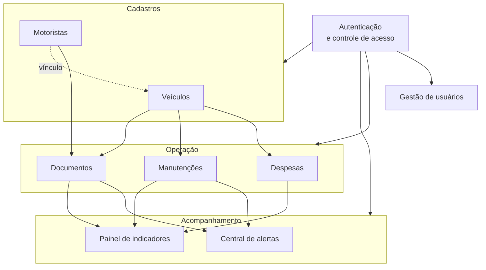

# Visão Geral do Projeto

**Projeto:** Fleet Manager — Sistema de Gestão Inteligente de Frotas
**Código do Projeto:** FM-PFI-2026

---

## 1. O que é o Fleet Manager

O Fleet Manager é uma aplicação web que centraliza o controle **operacional, financeiro e documental** de uma frota de veículos. Ele substitui o conjunto de planilhas e registros dispersos normalmente utilizado por organizações de pequeno e médio porte por uma base de dados única, na qual toda informação é organizada em torno do veículo.

A caracterização completa do problema e a delimitação do escopo estão em [01-descricao-do-problema-e-escopo.md](01-descricao-do-problema-e-escopo.md).

---

## 2. Módulos do sistema



| Módulo | Finalidade |
|---|---|
| **Autenticação e controle de acesso** | Cadastro, login, aprovação de contas e definição de perfis. |
| **Veículos** | Registro dos veículos da frota, com desativação e exclusão permanente. |
| **Motoristas** | Registro dos condutores, incluindo CNH e sua validade, e vínculo com veículos. |
| **Despesas** | Lançamento de gastos por veículo, distribuídos em seis categorias. |
| **Manutenções** | Programação e acompanhamento de manutenções preventivas e corretivas. |
| **Documentos** | Registro de documentos obrigatórios com data de vencimento e anexo digital. |
| **Central de alertas** | Consolidação de vencimentos e pendências que exigem atenção. |
| **Painel de indicadores** | Consolidação financeira e operacional, com filtros e gráficos. |
| **Gestão de usuários** | Administração das contas de acesso pelo administrador. |

---

## 3. Perfis de usuário

| Perfil | Corresponde a | Alcance no sistema |
|---|---|---|
| **ADMIN** | Proprietário ou responsável máximo pela frota | Acesso irrestrito, incluindo a gestão de usuários |
| **MANAGER** | Gestor da operação | Administra cadastros, documentos e indicadores; não gerencia usuários |
| **OPERATOR** | Motorista ou condutor | Registra despesas e manutenções e consulta as informações da frota |

A matriz completa de permissões encontra-se em [03-requisitos.md](03-requisitos.md#4-matriz-de-controle-de-acesso-rbac).

---

## 4. Jornada típica de uso


---

## 5. Organização do repositório

O projeto é estruturado como **monorepo** gerenciado por npm workspaces.

```text
fleet-manager/
├── apps/
│   ├── api/          Backend — API REST em Node.js, Express e Prisma
│   └── web/          Frontend — SPA em React e Vite
├── packages/
│   └── shared/       Enumerações e DTOs compartilhados
├── docs/             Documentação do projeto
├── supabase/         Scripts SQL — schema completo e Storage
└── package.json      Definição dos workspaces
```

A adoção de monorepo é justificada pelo compartilhamento de tipos entre frontend e backend: uma alteração de contrato provoca erro de compilação em ambos os lados, impedindo divergência silenciosa.

---

## 6. Tecnologias

| Camada | Tecnologia |
|---|---|
| Linguagem | TypeScript |
| Frontend | React 18, Vite, React Router, TailwindCSS, Recharts, i18next |
| Backend | Node.js, Express 4 |
| ORM | Prisma 6 |
| Banco de dados | PostgreSQL (Supabase) |
| Arquivos | Supabase Storage |
| Autenticação | Supabase Auth (e-mail e senha) |
| Verificação do token na API | `jose` — JWKS com chave pública ES256 |
| Validação | Zod |
| Agendamento | node-cron |
| Testes | Vitest |

---

## 7. Estado atual

O produto mínimo viável está **funcionalmente completo em ambiente de desenvolvimento**: todos os módulos possuem persistência real em banco de dados relacional, o código compila sem erros e 100 testes automatizados são aprovados.

Permanece pendente a publicação em ambiente de produção. O detalhamento encontra-se em [06-status-de-desenvolvimento.md](06-status-de-desenvolvimento.md).

---

## 8. Índice da documentação

| Documento | Conteúdo |
|---|---|
| [01-descricao-do-problema-e-escopo.md](01-descricao-do-problema-e-escopo.md) | Problema, solução, objetivos e escopo |
| [02-visao-geral-do-projeto.md](02-visao-geral-do-projeto.md) | Este documento |
| [03-requisitos.md](03-requisitos.md) | Requisitos funcionais, não funcionais e regras de negócio |
| [04-arquitetura.md](04-arquitetura.md) | Arquitetura da solução |
| [05-banco-de-dados.md](05-banco-de-dados.md) | Modelo de dados |
| [06-status-de-desenvolvimento.md](06-status-de-desenvolvimento.md) | Status detalhado por funcionalidade |
| [07-configuracao-e-execucao.md](07-configuracao-e-execucao.md) | Instalação e execução |
| [08-proximas-etapas.md](08-proximas-etapas.md) | Próximas etapas |
