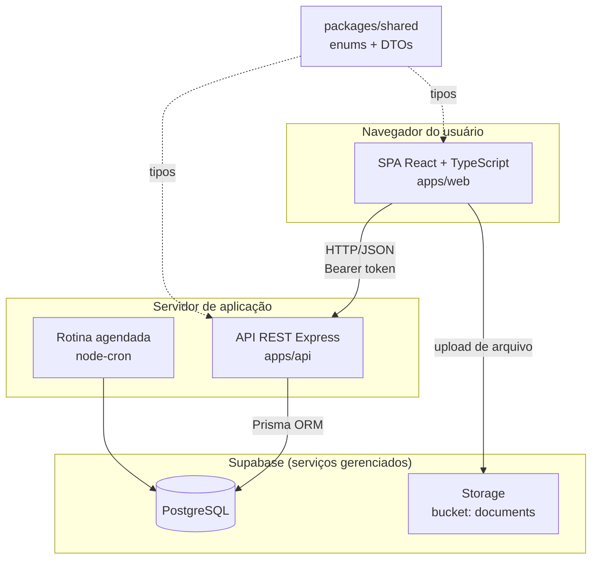
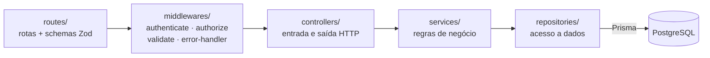
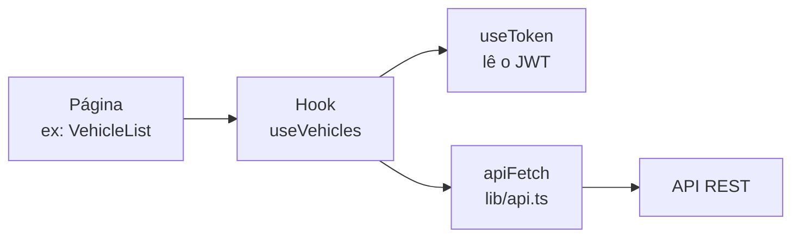
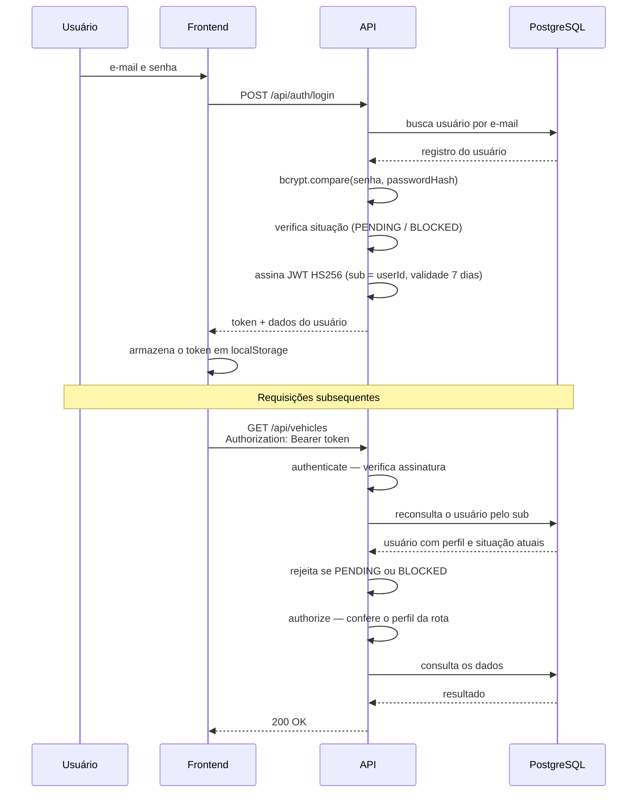
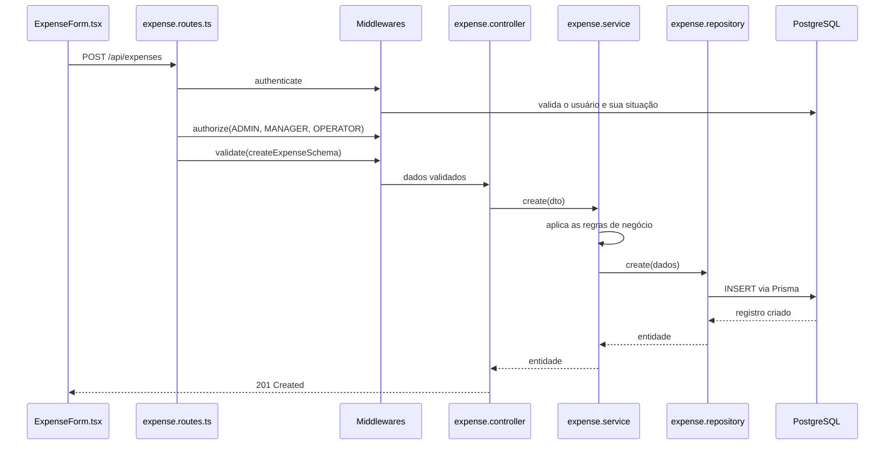
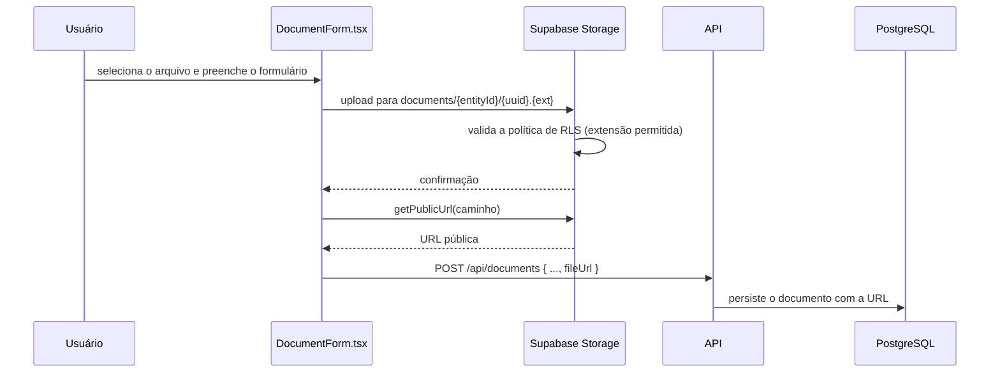

# Arquitetura da Solução

**Projeto:** Fleet Manager — Sistema de Gestão Inteligente de Frotas
**Código do Projeto:** FM-PFI-2026

Este documento descreve a arquitetura **efetivamente implementada** no repositório. Decisões previstas em documentos anteriores do projeto e que não chegaram a ser implementadas estão registradas na seção 9.

---

## 1. Visão geral

O Fleet Manager adota arquitetura **cliente-servidor** com separação estrita entre apresentação e processamento, distribuída em três artefatos de software organizados em um monorepo:

| Artefato | Responsabilidade |
|---|---|
| `apps/web` | Interface de usuário — SPA React executada no navegador |
| `apps/api` | API REST — regras de negócio e acesso a dados |
| `packages/shared` | Contrato de tipos compartilhado entre os dois anteriores |

A comunicação entre cliente e servidor ocorre exclusivamente por **HTTP/JSON**, com autenticação por token JWT transmitido no cabeçalho `Authorization`.



**Observação relevante.** O Supabase cumpre dois papéis independentes: hospeda o banco PostgreSQL (acessado apenas pelo backend, via Prisma) e fornece o armazenamento de arquivos (acessado diretamente pelo navegador). O upload de arquivos **não transita pela API** — implicações discutidas na seção 6.

---

## 2. Arquitetura do backend

O backend adota **arquitetura em camadas** (*Layered Architecture*), com dependência unidirecional: cada camada conhece apenas a camada imediatamente inferior.



### Responsabilidade de cada camada

| Camada | Responsabilidade | Restrição |
|---|---|---|
| **routes** | Declara as rotas, define o schema Zod de validação e encadeia os middlewares. | Não contém lógica. |
| **middlewares** | Autenticação, autorização, validação de entrada e tratamento centralizado de erros. | Transversal a todas as rotas protegidas. |
| **controllers** | Traduz a requisição HTTP em chamada de serviço e o retorno em resposta HTTP. | Não contém regra de negócio. |
| **services** | Concentra as regras de negócio e a orquestração das operações. | **Não conhece Express** — não recebe `req` nem `res`. |
| **repositories** | Encapsula todo o acesso ao banco por meio do Prisma. | Única camada que importa o cliente Prisma. |

O isolamento da camada de serviços em relação ao HTTP é o que viabiliza os testes unitários: os serviços são testados com repositórios substituídos por dublês, sem necessidade de subir servidor ou banco de dados.

### Estrutura de diretórios

```text
apps/api/src/
├── config/          env.ts (validação Zod), database.ts (instância única do Prisma)
├── routes/          8 routers — auth, users, vehicles, drivers,
│                    expenses, maintenances, documents, dashboard
├── middlewares/     authenticate, authorize, validate, error-handler
├── controllers/     8 controllers
├── services/        8 services + __tests__/
├── repositories/    7 repositories + __tests__/
├── jobs/            alertCron.ts — rotina diária de sinalização
├── lib/             verify-token.ts (assinatura e verificação JWT), user-dto.ts
├── types/           express.d.ts — extensão do objeto Request
├── app.ts           montagem da aplicação Express
└── server.ts        ponto de entrada
```

---

## 3. Arquitetura do frontend

O frontend é uma **Single Page Application** organizada por responsabilidade:

```text
apps/web/src/
├── pages/           21 páginas, uma por rota
├── components/      Componentes reutilizáveis — Header, Sidebar,
│                    ConfirmDialog, FilePreviewModal,
│                    ProtectedRoute, AccessGate
├── hooks/           11 hooks de dados — encapsulam as chamadas à API
├── lib/             api.ts (cliente HTTP), supabase.ts (storage),
│                    i18n.ts, roles.ts, current-user.ts
├── layouts/         AppLayout — moldura das telas autenticadas
├── locales/         pt-BR.json · en-US.json
└── App.tsx          definição das rotas
```

### Padrão de acesso a dados

Não há biblioteca de gerenciamento de estado global nem de cache de requisições. Cada tela consome um **hook dedicado** que encapsula a chamada HTTP e expõe os estados de carregamento, erro e dados:



O cliente HTTP centralizado (`lib/api.ts`) monta a URL base, injeta o cabeçalho `Authorization` e normaliza o tratamento de erros, incluindo a detecção de respostas HTML — situação típica de backend fora do ar.

Essa abordagem é adequada à escala do projeto: o estado é predominantemente local à tela e há pouca necessidade de compartilhamento entre rotas. O custo é a ausência de cache entre navegações, com nova requisição a cada montagem de componente.

---

## 4. Fluxo de autenticação e autorização

O sistema utiliza **autenticação própria**: as credenciais são verificadas pela própria API e o token é assinado localmente com uma chave simétrica.



### Decisões de segurança adotadas

| Decisão | Justificativa |
|---|---|
| Senha armazenada com hash **bcrypt**, fator de custo 10 | A senha nunca é persistida nem trafega em texto claro. |
| Token assinado em **HS256** com segredo de no mínimo 32 caracteres | Validado na inicialização por schema Zod. |
| O middleware **reconsulta o usuário no banco a cada requisição** | Permite que bloqueio ou alteração de perfil tenham efeito imediato, sem aguardar a expiração do token. |
| Autorização declarada **por rota**, e não no corpo dos serviços | Torna a matriz de permissões auditável pela leitura dos arquivos de rota. |
| Validação de entrada com **Zod antes da camada de negócio** | Requisições malformadas são rejeitadas antes de alcançar a lógica da aplicação. |

### Ausência de Row Level Security

O banco **não utiliza RLS (Row Level Security)**. Trata-se de decisão arquitetural consciente e não de omissão: o PostgreSQL é acessado exclusivamente pelo backend, por meio de uma única credencial de serviço, e o navegador nunca se conecta diretamente ao banco. A autorização é integralmente aplicada na camada de aplicação, pelo middleware `authorize`.

O RLS seria indispensável no modelo em que o cliente consulta o banco diretamente — cenário que esta arquitetura não adota. Há, contudo, política de RLS aplicada ao **Storage**, onde o navegador é de fato o agente da requisição (seção 6).

---

## 5. Fluxo de uma requisição típica

Exemplo: cadastro de uma despesa por um usuário com perfil OPERATOR.



Qualquer exceção lançada em qualquer camada é capturada pelo `error-handler`, que converte instâncias de `AppError` em respostas HTTP com o código correspondente e trata as demais como erro interno.

---

## 6. Armazenamento de arquivos

O anexo de documentos utiliza o **Supabase Storage**, com upload realizado diretamente pelo navegador.



### Consequências deste desenho

O upload direto reduz a carga sobre a API e dispensa o tráfego do arquivo por um intermediário. Em contrapartida, introduz três limitações que devem ser declaradas:

1. **Não há validação de tipo ou tamanho no servidor de aplicação.** A restrição de extensões é aplicada pela política de RLS do Storage, definida em [`supabase/storage-setup.sql`](../supabase/storage-setup.sql).
2. **Arquivos órfãos.** A exclusão de um documento remove o registro no banco, mas não remove o arquivo correspondente no bucket.
3. **O bucket é público.** Quem possuir a URL acessa o arquivo sem autenticação.

Essas limitações estão registradas em [08-proximas-etapas.md](08-proximas-etapas.md).

---

## 7. Processamento agendado

A rotina `jobs/alertCron.ts` é registrada na inicialização da aplicação e executa **diariamente à meia-noite**:

1. Consulta os documentos que vencem em até 30 dias e ainda não foram sinalizados;
2. Marca esses documentos com `alertSent = true`, em operação idempotente;
3. Registra a quantidade processada no log da aplicação.

A rotina é desativada quando `NODE_ENV=test`, evitando interferência na execução dos testes.

> **Delimitação explícita.** Esta rotina **não envia notificação para fora do sistema** — ela sinaliza registros no banco, e a exibição do alerta ocorre na interface, para quem acessa a aplicação. A notificação por canais externos foi deliberadamente excluída do escopo do projeto, e não constitui pendência de implementação. A justificativa está em [01-descricao-do-problema-e-escopo.md](01-descricao-do-problema-e-escopo.md#10-fora-do-escopo).

---

## 8. Contrato compartilhado

O pacote `packages/shared` é consumido tanto pelo frontend quanto pelo backend e concentra:

- **Enumerações** — `UserRole`, `UserStatus`, `VehicleStatus`, `DriverStatus`, `ExpenseType`, `MaintenanceType`, `MaintenanceStatus`, `DocumentType`;
- **DTOs** — interfaces de requisição e resposta de cada entidade.

O ganho arquitetural é concreto: uma alteração em uma enumeração provoca **erro de compilação em ambos os lados** caso não seja tratada, o que impede a divergência silenciosa de contrato entre cliente e servidor.

---

## 9. Decisões previstas em documentos anteriores e não implementadas

Documentos anteriores do projeto — em especial *Modelagem e Arquitetura (17/03/2026)* — descrevem componentes que **não integram a implementação atual**. O registro abaixo evita divergência entre a documentação e o sistema.

| Componente previsto | Situação real | Justificativa |
|---|---|---|
| **Auth0** como provedor de identidade | Substituído por autenticação própria com JWT | Reduziu a dependência externa e o acoplamento a um serviço de terceiros, além de simplificar a execução local. |
| **AWS ECS** para publicação do backend | Não implementado | A publicação está pendente. A plataforma definida atualmente é o Railway. |
| **AWS RDS** como banco de dados | Substituído pelo PostgreSQL do Supabase | Serviço gerenciado com camada gratuita adequada ao projeto e administração integrada. |
| **Redis** para cache e filas | Não implementado | O volume de dados e a complexidade do MVP não justificaram a introdução de uma camada de cache. Não há dependência de Redis no projeto. |
| **Docker** em produção | Não implementado | Existe um arquivo `docker-compose.yml` para PostgreSQL local, mantido apenas como alternativa de desenvolvimento. |

---

## 10. Avaliação da arquitetura

**Adequação ao porte do projeto.** A arquitetura em camadas com ORM tipado e contrato compartilhado é proporcional ao escopo: oferece separação de responsabilidades suficiente para sustentar testes automatizados e evolução incremental, sem introduzir a complexidade de padrões como CQRS, mensageria ou serviços distribuídos, que não se justificariam neste contexto.

**Pontos fortes verificados:**
- Separação de camadas efetivamente respeitada — nenhum serviço importa Express, nenhum controller importa Prisma;
- Cobertura de 99 testes automatizados viabilizada justamente por esse isolamento;
- Contrato de tipos compartilhado, que impede divergência entre cliente e servidor;
- Autorização declarativa e auditável por rota.

**Limitações reconhecidas:**
- O upload direto ao Storage contorna a camada de validação da aplicação (seção 6);
- Não há cache de requisições no cliente, resultando em requisições repetidas entre navegações;
- O pacote JavaScript do frontend é gerado em arquivo único, sem divisão por rota;
- Não há testes automatizados na camada de interface;
- As entidades *Motorista* e *Usuário* não possuem vínculo formal no modelo de dados, embora representem, na prática, a mesma pessoa quando o usuário tem perfil OPERATOR.

---

## Documentos relacionados

- [01-descricao-do-problema-e-escopo.md](01-descricao-do-problema-e-escopo.md) — problema, escopo e objetivos
- [03-requisitos.md](03-requisitos.md) — requisitos e matriz RBAC
- [05-banco-de-dados.md](05-banco-de-dados.md) — modelo de dados detalhado
- [06-status-de-desenvolvimento.md](06-status-de-desenvolvimento.md) — status por funcionalidade
