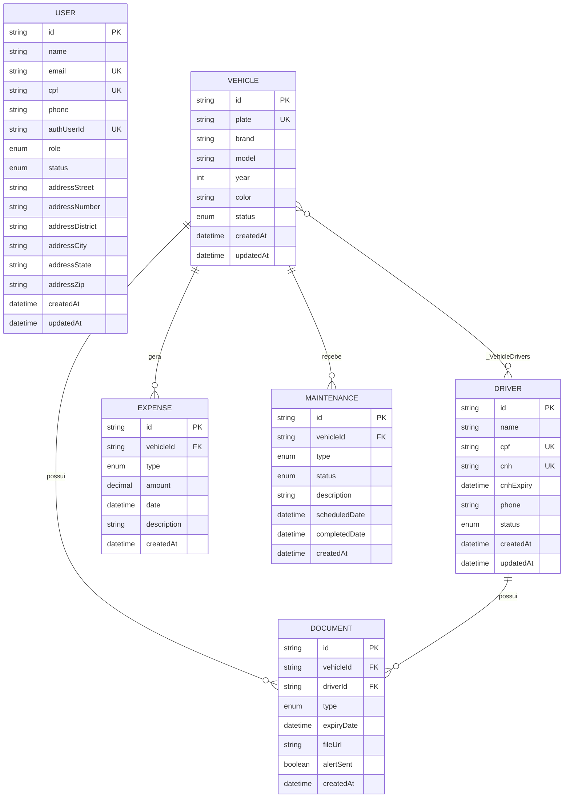

# Banco de Dados

**Projeto:** Fleet Manager — Sistema de Gestão Inteligente de Frotas
**SGBD:** PostgreSQL (hospedado no Supabase)
**ORM:** Prisma 6
**Fonte da verdade do schema:** [`apps/api/prisma/schema.prisma`](../apps/api/prisma/schema.prisma)

---

## 1. Visão geral

O modelo de dados é composto por **6 entidades** e **8 enumerações**. Toda a estrutura é versionada por migrations, o que permite reconstruir o banco a partir do repositório.

O modelo organiza-se em torno da entidade **Veículo**, que concentra as três dimensões da gestão de frota: despesas (dimensão financeira), manutenções (dimensão operacional) e documentos (dimensão documental).

### Modelo entidade-relacionamento



> **Nota.** A entidade `USER` não possui relacionamento com as demais tabelas da aplicação. Ela representa o perfil de acesso ao sistema, enquanto `DRIVER` representa o cadastro do motorista. A ausência de vínculo é uma limitação conhecida do modelo, discutida na seção 6. O vínculo com a conta de autenticação é externo ao schema `public`, feito pela coluna `authUserId` (ver seção 2.1).

---

## 2. Dicionário de dados

### 2.1. User — contas de acesso ao sistema

Armazena o **perfil de aplicação** de cada usuário: dados cadastrais, papel de acesso e situação de aprovação.

As credenciais (e-mail e senha) **não residem nesta tabela** — são gerenciadas pelo Supabase Auth, no schema `auth`. A coluna `authUserId` estabelece o vínculo entre as duas. O e-mail é mantido também aqui, por ser dado cadastral e permitir vincular perfis criados previamente à conta de acesso correspondente.

| Campo | Tipo | Restrições | Descrição |
|---|---|---|---|
| `id` | String | PK, `cuid()` | Identificador único |
| `name` | String | obrigatório | Nome completo |
| `email` | String | **único**, obrigatório | E-mail, usado como credencial de login |
| `cpf` | String | **único**, obrigatório | CPF, 11 dígitos numéricos |
| `phone` | String | obrigatório | Telefone de contato |
| `authUserId` | String | **único**, opcional | Identificador da conta no Supabase Auth (`auth.users.id`). Nulo enquanto o perfil não estiver vinculado a uma conta de acesso. |
| `role` | UserRole | padrão `OPERATOR` | Perfil de acesso |
| `status` | UserStatus | padrão `PENDING` | Situação da conta |
| `addressStreet` | String | obrigatório | Logradouro |
| `addressNumber` | String | obrigatório | Número |
| `addressDistrict` | String | obrigatório | Bairro |
| `addressCity` | String | obrigatório | Cidade |
| `addressState` | String | obrigatório | Unidade federativa (2 caracteres) |
| `addressZip` | String | obrigatório | CEP |
| `createdAt` | DateTime | automático | Data de criação |
| `updatedAt` | DateTime | automático | Data da última alteração |

**Uso pela aplicação:** `auth.service` (criação e vínculo do perfil), `authenticate` (busca por `authUserId` a cada requisição), `user.service` (gestão e perfil próprio).

### 2.2. Vehicle — veículos da frota

Entidade central do modelo.

| Campo | Tipo | Restrições | Descrição |
|---|---|---|---|
| `id` | String | PK, `cuid()` | Identificador único |
| `plate` | String | **único**, obrigatório | Placa, normalizada em maiúsculas |
| `brand` | String | obrigatório | Marca |
| `model` | String | obrigatório | Modelo |
| `year` | Int | obrigatório, 1900–2030 | Ano de fabricação |
| `color` | String | obrigatório | Cor |
| `status` | VehicleStatus | padrão `ACTIVE` | Situação do veículo na frota |
| `createdAt` / `updatedAt` | DateTime | automático | Controle temporal |

**Relacionamentos:** 1:N com Expense, Maintenance e Document; N:M com Driver.

### 2.3. Driver — motoristas

| Campo | Tipo | Restrições | Descrição |
|---|---|---|---|
| `id` | String | PK, `cuid()` | Identificador único |
| `name` | String | obrigatório | Nome completo |
| `cpf` | String | **único**, obrigatório | CPF, 11 dígitos numéricos |
| `cnh` | String | **único**, obrigatório | Número da CNH |
| `cnhExpiry` | DateTime | obrigatório | Validade da CNH |
| `phone` | String | opcional | Telefone |
| `status` | DriverStatus | padrão `ACTIVE` | Situação do motorista |
| `createdAt` / `updatedAt` | DateTime | automático | Controle temporal |

### 2.4. Expense — despesas operacionais

| Campo | Tipo | Restrições | Descrição |
|---|---|---|---|
| `id` | String | PK, `cuid()` | Identificador único |
| `vehicleId` | String | **FK obrigatória** → Vehicle | Veículo ao qual a despesa pertence |
| `type` | ExpenseType | obrigatório | Categoria da despesa |
| `amount` | Decimal(10,2) | obrigatório, positivo | Valor |
| `date` | DateTime | obrigatório | Data de ocorrência |
| `description` | String | opcional | Descrição livre |
| `createdAt` | DateTime | automático | Data de registro |

A obrigatoriedade de `vehicleId` implementa a regra **RN01** e é o que garante a apuração confiável do custo por veículo. O tipo `Decimal(10,2)` foi adotado em vez de ponto flutuante para evitar erro de arredondamento em valores monetários.

**Exclusão em cascata:** remover permanentemente um veículo remove suas despesas.

### 2.5. Maintenance — manutenções

| Campo | Tipo | Restrições | Descrição |
|---|---|---|---|
| `id` | String | PK, `cuid()` | Identificador único |
| `vehicleId` | String | **FK obrigatória** → Vehicle | Veículo atendido |
| `type` | MaintenanceType | obrigatório | Preventiva ou corretiva |
| `status` | MaintenanceStatus | padrão `SCHEDULED` | Situação da manutenção |
| `description` | String | obrigatório | Descrição do serviço |
| `scheduledDate` | DateTime | obrigatório | Data prevista |
| `completedDate` | DateTime | opcional | Data de conclusão |
| `createdAt` | DateTime | automático | Data de registro |

A relação entre `status` e `completedDate` é mantida consistente pelo serviço, conforme a regra **RN09**.

### 2.6. Document — documentos obrigatórios

| Campo | Tipo | Restrições | Descrição |
|---|---|---|---|
| `id` | String | PK, `cuid()` | Identificador único |
| `vehicleId` | String | FK opcional → Vehicle | Veículo, quando o documento for veicular |
| `driverId` | String | FK opcional → Driver | Motorista, quando o documento for pessoal |
| `type` | DocumentType | obrigatório | Tipo do documento |
| `expiryDate` | DateTime | obrigatório | Data de vencimento |
| `fileUrl` | String | opcional | URL pública do arquivo no Supabase Storage |
| `alertSent` | Boolean | padrão `false` | Indica que o documento já foi sinalizado pela rotina |
| `createdAt` | DateTime | automático | Data de registro |

**Restrição de exclusividade (RN03).** Um documento deve referenciar **um veículo ou um motorista**, nunca ambos e nunca nenhum. Ambas as colunas são opcionais no banco; a exclusividade é garantida por validação Zod na camada de rotas.

> Esta é uma regra aplicada na aplicação e **não no banco**. Um `CHECK CONSTRAINT` garantiria a integridade também contra inserções feitas fora da aplicação. Registrado em [08-proximas-etapas.md](08-proximas-etapas.md).

**Situação de vencimento — campo calculado.** A situação do documento **não é armazenada**; é calculada a cada consulta a partir de `expiryDate`:

| Situação | Critério |
|---|---|
| `EXPIRED` | `expiryDate` anterior à data atual |
| `EXPIRING_SOON` | `expiryDate` entre a data atual e 30 dias à frente |
| `OK` | `expiryDate` posterior a 30 dias |

O cálculo dinâmico evita a necessidade de uma rotina que mantenha o campo atualizado e elimina a possibilidade de o dado ficar defasado.

### 2.7. _VehicleDrivers — vínculo veículo ↔ motorista

Tabela de junção implícita, gerenciada pelo Prisma, que materializa a relação muitos-para-muitos.

| Coluna | Descrição |
|---|---|
| `A` | Referência ao `Vehicle` |
| `B` | Referência ao `Driver` |

---

## 3. Enumerações

| Enumeração | Valores | Uso |
|---|---|---|
| `UserRole` | `ADMIN`, `MANAGER`, `OPERATOR` | Perfil de acesso (RBAC) |
| `UserStatus` | `PENDING`, `ACTIVE`, `BLOCKED` | Situação da conta |
| `VehicleStatus` | `ACTIVE`, `INACTIVE` | Situação do veículo |
| `DriverStatus` | `ACTIVE`, `INACTIVE` | Situação do motorista |
| `ExpenseType` | `FUEL`, `MAINTENANCE`, `FINE`, `IPVA`, `INSURANCE`, `OTHER` | Categoria de despesa |
| `MaintenanceType` | `PREVENTIVE`, `CORRECTIVE` | Natureza da manutenção |
| `MaintenanceStatus` | `SCHEDULED`, `DONE`, `OVERDUE` | Situação da manutenção |
| `DocumentType` | `CRLV`, `IPVA`, `SEGURO`, `CNH`, `LICENCA`, `OUTRO` | Tipo de documento |

As mesmas enumerações são declaradas em `packages/shared/src/enums/index.ts` e utilizadas pelo frontend, garantindo consistência entre banco, API e interface.

---

## 4. Controle de acesso ao banco

O acesso às tabelas ocorre exclusivamente pelo backend, via Prisma, com a credencial de serviço do PostgreSQL. A API REST gerada automaticamente pelo Supabase (PostgREST) **não é utilizada** por nenhuma parte do sistema.

Como essa API é exposta por padrão e responde à chave pública do projeto — distribuída junto com o frontend —, o script de criação do banco fecha esse caminho:

```sql
ALTER TABLE "User" ENABLE ROW LEVEL SECURITY;   -- e demais tabelas
REVOKE ALL ON ALL TABLES IN SCHEMA public FROM anon, authenticated;
```

Com RLS habilitado e **nenhuma policy criada**, os papéis públicos não acessam linha alguma. O papel proprietário das tabelas não é submetido a RLS, de modo que o Prisma não é afetado.

A autorização por perfil (RBAC) permanece na camada de aplicação, conforme [04-arquitetura.md](04-arquitetura.md).

---

## 5. Integridade referencial

| Relacionamento | Comportamento na exclusão | Efeito |
|---|---|---|
| Vehicle → Expense | `Cascade` | Excluir o veículo remove suas despesas |
| Vehicle → Maintenance | `Cascade` | Excluir o veículo remove suas manutenções |
| Vehicle → Document | `Cascade` | Excluir o veículo remove seus documentos |
| Driver → Document | `Cascade` | Excluir o motorista remove seus documentos |
| Vehicle ↔ Driver | Remoção do vínculo | Excluir qualquer um dos lados desfaz apenas a associação |

A exclusão em cascata sustenta a funcionalidade de **exclusão permanente**, distinta da **desativação**, que apenas altera o campo `status` e preserva integralmente o histórico (regras **RN07** e **RN08**).

---

## 6. Migrations e reprodutibilidade

O histórico de evolução do schema está versionado em `apps/api/prisma/migrations/`:

| Migration | Conteúdo |
|---|---|
| `20260415182317_init` | Criação inicial de todas as tabelas, enumerações e relacionamentos |
| `20260417223832_add_document_type_enum` | Conversão do tipo do documento em enumeração |
| `20260429003345_add_user_status` | Introdução da enumeração `UserStatus` e do fluxo de aprovação |
| `20260506000000_remove_auth0_add_custom_auth` | Remoção do identificador externo e adição dos campos de autenticação própria e endereço |
| `20260526172511_add_file_url_to_document` | Adição do campo `fileUrl` para o anexo digital |
| `20260826000000_supabase_auth` | Migração para o Supabase Auth: remoção de `passwordHash` e adição de `authUserId` |

### Reconstrução do banco em um ambiente novo

```bash
cd apps/api
npx prisma migrate deploy   # recria toda a estrutura relacional
npx prisma db seed          # popula a base com dados de demonstração
```

O bucket e as políticas do Storage são recriados separadamente, executando [`supabase/storage-setup.sql`](../supabase/storage-setup.sql) no editor SQL do Supabase.

**Grau de reprodutibilidade:**

| Componente | Reprodutível a partir do repositório |
|---|---|
| Estrutura relacional, enumerações, chaves e índices | ✅ Integralmente, por `prisma migrate deploy` ou pelo script SQL |
| Bloqueio de acesso externo (RLS e revogação) | ✅ Incluído no script SQL |
| Dados de demonstração | ✅ Pela rotina de povoamento |
| Bucket do Storage | ✅ Incluído no script SQL |
| Políticas do Storage | ⚠️ **Não** — exigem criação manual pelo painel, por limitação de propriedade da tabela `storage.objects`. Estão documentadas de forma prescritiva em [07-configuracao-e-execucao.md](07-configuracao-e-execucao.md#62-criar-as-políticas-pelo-painel). |
| Arquivos já enviados ao bucket | ❌ Residem apenas no serviço de armazenamento |

---

## 7. Limitações reconhecidas do modelo

| Limitação | Consequência | Encaminhamento |
|---|---|---|
| `User` e `Driver` não possuem vínculo | Um usuário com perfil OPERATOR, que na prática é o motorista, não pode ser associado ao seu cadastro de motorista nem ao veículo que conduz. | Introdução de uma chave estrangeira opcional entre as entidades. |
| Ausência de auditoria de autoria | Não é possível determinar qual usuário registrou determinada despesa ou manutenção. | Adição de coluna `createdById` nas entidades transacionais. |
| A exclusividade veículo/motorista em `Document` é validada apenas na aplicação | Inserções realizadas fora da aplicação podem violar a regra RN03. | Adição de `CHECK CONSTRAINT` por migration. |
| Não há integridade referencial entre `User.authUserId` e `auth.users.id` | O Prisma gerencia apenas o schema `public`; a exclusão de uma conta no Supabase Auth deixa o perfil órfão. | Avaliar chave estrangeira entre schemas ou rotina de conciliação. |
| Ausência de exclusão lógica em despesas e manutenções | A exclusão desses registros é definitiva e não preserva histórico. | Avaliar exclusão lógica caso a rastreabilidade se torne requisito. |

---

## 8. Dados de demonstração

A rotina [`apps/api/prisma/seed.ts`](../apps/api/prisma/seed.ts) popula o banco com uma frota fictícia consistente, empregada na validação do sistema:

- **3 usuários** — um por perfil (administrador, gestor e operador);
- **8 veículos**, **6 motoristas** e os respectivos vínculos;
- **27 despesas**, distribuídas entre todas as categorias e ao longo de vários meses, o que permite exercitar os gráficos de evolução do painel;
- **14 manutenções**, contemplando os três status;
- **25 documentos**, com vencimentos deliberadamente distribuídos entre vencidos, próximos do vencimento e regulares, de modo a exercitar a central de alertas.

A rotina é **idempotente**: executá-la novamente não duplica registros.

> **Perfis de demonstração.** A rotina cria os perfis `admin@fleet-manager.com` (ADMIN), `gerente@fleet-manager.com` (MANAGER) e `operador@fleet-manager.com` (OPERATOR), todos com situação `ACTIVE` e **sem conta de acesso vinculada** (`authUserId` nulo) — a rotina não cria contas no Supabase Auth.
>
> Para acessar o sistema com esses perfis, basta cadastrar os mesmos e-mails pela tela de cadastro da aplicação: a API detecta o perfil existente sem vínculo e o associa à conta recém-criada, preservando o papel e a situação `ACTIVE`. Esse mecanismo destina-se a ambiente de desenvolvimento e demonstração acadêmica.

---

## Documentos relacionados

- [04-arquitetura.md](04-arquitetura.md) — arquitetura da solução
- [03-requisitos.md](03-requisitos.md) — regras de negócio associadas
- [07-configuracao-e-execucao.md](07-configuracao-e-execucao.md) — configuração do banco
