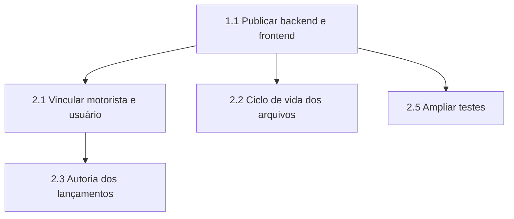

# Próximas Etapas

**Projeto:** Fleet Manager — Sistema de Gestão Inteligente de Frotas
**Referência:** [06-status-de-desenvolvimento.md](06-status-de-desenvolvimento.md)

Este documento organiza o trabalho restante em ordem de prioridade. Cada item decorre de uma pendência efetivamente identificada no sistema, e não de suposição.

---

## 1. Etapa imediata — conclusão do escopo previsto

> A notificação de vencimentos por canais externos **não figura entre as etapas abaixo**: foi excluída do escopo do projeto por decisão registrada em [01-descricao-do-problema-e-escopo.md](01-descricao-do-problema-e-escopo.md#10-fora-do-escopo).

### 1.1. Publicar o sistema em ambiente de produção

| Componente | Plataforma prevista |
|---|---|
| Frontend | Vercel |
| Backend | Railway |
| Banco de dados | Supabase |

**Ordem sugerida:** publicar o backend, obter sua URL pública, registrá-la em `VITE_API_URL`, incluir a URL do frontend em `CORS_ORIGINS` e então publicar o frontend.

**Justificativa.** Concluir a etapa final prevista no planejamento e permitir a demonstração do sistema sem depender de ambiente local.

### 1.2. Avaliar a confirmação de e-mail no cadastro

**Situação.** A confirmação de e-mail está desativada no projeto Supabase, pois não há serviço de envio configurado. A posse do endereço informado não é verificada no cadastro.

**Encaminhamento.** Caso o envio de e-mail passe a integrar o escopo, reativar a confirmação no painel do Supabase — o fluxo de cadastro já trata essa resposta e informa o usuário.

**Justificativa.** O risco é mitigado pela aprovação manual do administrador, exigida antes de qualquer acesso. O registro da limitação evita que a ausência de verificação passe despercebida.

---

## 2. Etapa seguinte — consolidação técnica

### 2.1. Vincular motorista e conta de usuário

**Situação.** O perfil OPERATOR corresponde ao motorista, mas `Driver` e `User` são entidades independentes e sem relacionamento no banco.

**Encaminhamento.** Introduzir uma chave estrangeira opcional entre as entidades, por migration, permitindo associar a conta de acesso ao cadastro do motorista.

**Justificativa.** Elimina a divergência entre o modelo conceitual descrito na documentação e o modelo implementado. Habilita, adicionalmente, a restrição do operador aos veículos que efetivamente conduz.

### 2.2. Tratar o ciclo de vida dos arquivos no Storage

**Situação.** Excluir um documento remove o registro no banco, mas mantém o arquivo no bucket.

**Encaminhamento.** Remover o objeto correspondente ao excluir o documento e avaliar a substituição do bucket público por bucket privado com URLs assinadas de validade limitada.

**Justificativa.** Evita o acúmulo indefinido de arquivos órfãos e reduz a exposição de documentos cujo acesso hoje depende apenas do conhecimento da URL.

### 2.3. Registrar autoria dos lançamentos

**Situação.** Não é possível determinar qual usuário registrou uma despesa ou manutenção.

**Encaminhamento.** Adicionar coluna `createdById` nas entidades transacionais, preenchida a partir do usuário autenticado.

**Justificativa.** Rastreabilidade é consequência natural da segregação de responsabilidades que o controle de acesso por perfil estabelece.

### 2.4. Reforçar a integridade da regra RN03 no banco

**Situação.** A exclusividade entre veículo e motorista em `Document` é garantida apenas pela validação da aplicação.

**Encaminhamento.** Adicionar `CHECK CONSTRAINT` por migration.

**Justificativa.** Move a garantia da regra para a camada mais confiável, tornando-a válida também para operações realizadas fora da aplicação.

### 2.5. Ampliar a cobertura de testes

**Situação.** Os 100 testes existentes concentram-se nas regras de negócio do backend. Não há testes de interface nem de integração da API.

**Encaminhamento.** Introduzir testes de integração com `supertest` — já presente entre as dependências — e testes de componente no frontend.

---

## 3. Etapa de melhoria — qualidade e desempenho

| Item | Situação | Encaminhamento |
|---|---|---|
| Divisão do pacote JavaScript | Arquivo único de 969 kB | Aplicar divisão por rota com importação dinâmica |
| Cache de requisições no cliente | Ausente | Avaliar biblioteca de cache de dados para evitar requisições repetidas |
| Medição do RNF04 | Sem verificação empírica | Medir o tempo de resposta das operações comuns e registrar o resultado |
| Integração contínua | Ausente | Configurar execução automática dos testes a cada envio de código |
| Acessibilidade | Não avaliada | Verificar conformidade com as diretrizes WCAG |

---

## 4. Possibilidades de continuidade

Itens fora do escopo desta versão, registrados como desdobramentos possíveis do trabalho:

| Possibilidade | Descrição |
|---|---|
| **Validação em organização real** | Aplicar o sistema em uma frota real e medir comparativamente os indicadores antes e depois da adoção — única forma de comprovar empiricamente os resultados esperados descritos no escopo. |
| **Exportação de relatórios** | Geração de relatórios em PDF ou planilha a partir dos indicadores. |
| **Manutenção preventiva recorrente** | Programação automática de manutenções por quilometragem ou periodicidade. |
| **Controle de abastecimento** | Registro de litragem e quilometragem para apuração de consumo médio por veículo. |
| **Aplicativo móvel** | Interface nativa para o operador registrar despesas em campo. |

> As três primeiras possibilidades constituem evolução natural do escopo atual. As duas últimas foram explicitamente excluídas do escopo do projeto, conforme [01-descricao-do-problema-e-escopo.md](01-descricao-do-problema-e-escopo.md#10-fora-do-escopo), e permanecem registradas apenas como direção futura.

---

## 5. Ordem de execução recomendada

A publicação em produção (1.1) é o item de maior valor imediato, pois viabiliza a demonstração do sistema e encerra a última etapa prevista no planejamento.

Concluída a publicação, o item de maior valor técnico é o vínculo entre motorista e conta de usuário (2.1), por eliminar a única divergência remanescente entre o modelo conceitual descrito na documentação e o modelo implementado.

---

## Documentos relacionados

- [06-status-de-desenvolvimento.md](06-status-de-desenvolvimento.md) — pendências que originam estas etapas
- [01-descricao-do-problema-e-escopo.md](01-descricao-do-problema-e-escopo.md) — delimitação do escopo
